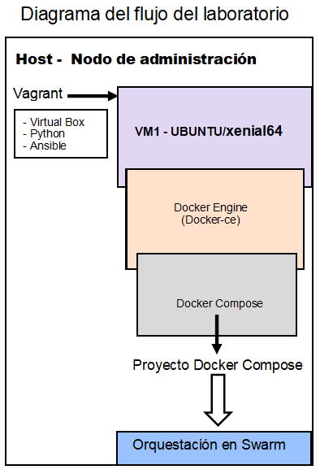

# Evaluación de automatización (Mínimo requerido)
## Puntos desarrollados
1. Se crea VM con Vagrant y se provisiona un Docker Engine con Ansible utilizando playbook local.
2. Se despliega la aplicación dockerizada sobre la VM usando Ansible y Docker-compose.
3. Se crea el repositorio en Github con los archivos necesarios para crear la infraestructura virtual, el README file con la documentación para replicar el escenario y el diagrama que explica el flujo.
4. Lo anterior queda montado sobre orquestador docker Swarm.



## Requisitos
Para poder ejecutar este código se necesita contar en el host con:
* vagrant 2.2.3
* ansible 2.8.4

- ## Ejecución de prueba
```
git clone https://github.com/fahumadar/laboratorio_devops.git
cd laboratorio_devops
vagrant up
```
- ## Para desplegar en Swarm, debemos ejecutar el siguente comando (se debe tener acceso al cluster Swarm)
```
git clone https://github.com/fahumadar/laboratorio_devops.git
cd laboratorio_devops
sudo docker stack deploy --compose-file=docker-compose.yml redis
```
